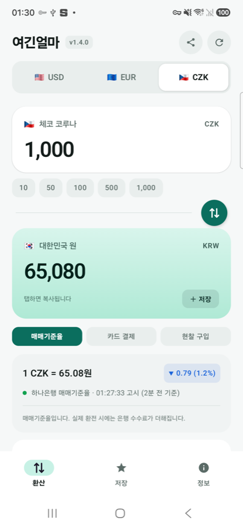
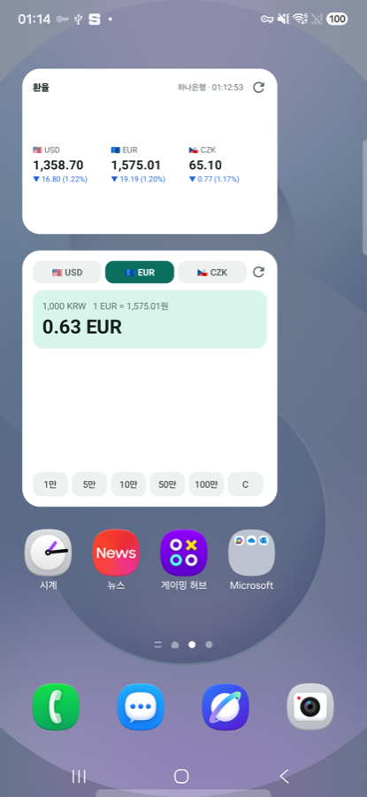

# 여긴얼마? (PriceHere)

여행지에서 "이거 얼마지?"를 바로 답하는 안드로이드 환율 앱입니다.
미국 달러 · 유로 · 일본 엔 · 체코 코루나를 원화로 환산합니다.

 

## 받기

[최신 릴리스](https://github.com/wjdals988/pricehere/releases/latest)에서 서명된 APK를 내려받아 설치합니다.
플레이스토어에는 올리지 않았습니다. Android 8.0(API 26) 이상.

## 기능

- **실시간 환율** — 하나은행 매매기준율을 고시회차마다 조회합니다. 엔화는 은행 고시 그대로 100엔 단위로 보여주되, 100엔 미만 금액도 정확히 계산합니다.
- **3단 폴백** — 하나은행 → ECB 기준환율 → 마지막으로 받아둔 캐시. 비행기 모드에서도 계산이 멈추지 않습니다.
- **신선도 표시** — 고시 시각을 초 단위로 보여줘 은행 화면과 직접 대조할 수 있습니다. 새로고침을 눌렀을 때 값이 바뀌었는지 아닌지도 그때마다 알려줍니다.
- **결제 수단별 실부담** — 매매기준율 / 카드 결제 / 현찰 구입 추정치를 전환합니다.
- **환율 추이** — 7일 · 30일 · 90일 그래프와 최저 · 최고 · 평균. ECB 기준환율이라 주말과 공휴일은 비어 있습니다.
- **팁 계산** — 나라별 관행에 맞춘 비율과 인원수 분배. 일본처럼 팁이 없는 곳은 그렇게 안내합니다.
- **세금 환급 계산** — 체코 · 스페인 · 일본의 부가세 환급 예상액과 최소 구매 금액. 일본은 2026년 11월 1일 제도 개편에 맞춰 즉시 면세와 공항 환급을 나눠 계산합니다.
- **저장 목록** — 금액에 메모를 붙여 두고, 나중에 최신 환율로 다시 확인합니다. 저장 시점과의 차이도 함께 보여주고, 원하는 항목만 골라 공유할 수 있습니다.
- **다크 모드** — 시스템 설정을 따르거나 밝게 · 어둡게 고정합니다.
- **변경 이력과 업데이트 알림** — 새 릴리스가 있으면 버전 옆에 점이 붙고, 버전을 누르면 그동안 무엇이 바뀌었는지 볼 수 있습니다.

## 홈 화면 위젯

앱을 열지 않고 홈 화면에서 바로 씁니다. 세 가지 모두 현지 통화 → 원화 방향입니다.

| 위젯 | 크기 | 하는 일 |
| --- | --- | --- |
| 환율 보기 | 4×2 | 달러 · 유로 · 엔 · 코루나 환율을 한눈에 |
| 빠른 계산 | 4×2 | 통화와 금액을 골라 원화를 바로 계산 |
| 환율 계산기 | 4×5 | 위젯 안에서 금액을 직접 눌러 환산 |

## 기술

Kotlin · Jetpack Compose (Material 3) · AppWidget(RemoteViews)
AGP 8.13.2 · Kotlin 2.2.10 · Compose BOM 2026.05.01 · compileSdk 36 · minSdk 26

의존성을 의도적으로 최소화했습니다. 네트워크는 `HttpURLConnection`, JSON은 안드로이드 내장 `org.json`,
저장은 `SharedPreferences`를 씁니다. Retrofit · OkHttp · Room · Hilt를 쓰지 않고 차트도 직접 그려서
릴리스 APK가 약 1.4MB입니다. 권한은 `INTERNET` 하나뿐입니다.

화면 전체가 `Tokens.kt` 한 파일의 값을 씁니다. 모서리 반경 3종, 여백 7종, 그림자 2종, 서체 8단계로
제한해 두어서 간격이나 곡률을 바꿀 일이 생기면 그 파일만 고치면 됩니다. 금액과 환율에는
자릿수 고정 숫자(`tnum`)를 적용해 값이 바뀔 때 좌우로 흔들리지 않습니다.

위젯의 키패드는 `RemoteViews`가 `EditText`를 지원하지 않기 때문에,
버튼 16개와 `PendingIntent` 브로드캐스트로 입력을 구현했습니다.

## 빌드

```bash
./gradlew assembleDebug
```

릴리스 빌드는 서명 키가 필요합니다. `keystore.properties.example`을 `keystore.properties`로
복사해 값을 채우면 `assembleRelease`가 자동으로 서명합니다(v2 · v3 서명 체계).
`keystore.properties`와 `*.jks`는 `.gitignore`에 등록되어 있어 커밋되지 않습니다.

```bash
./gradlew assembleRelease
```

## 환율 데이터 출처

매매기준율은 하나은행 고시 환율이며 네이버 마켓인덱스를 통해 조회합니다.
보조 환율과 추이 그래프는 유럽중앙은행(ECB) 기준환율을 [Frankfurter API](https://frankfurter.dev)로 받아옵니다.
두 출처 모두 이 앱과 제휴 관계가 없으며, 상표권은 각 권리자에게 있습니다.
표시되는 환율은 참고용이며, 실제 환전·결제 금액은 은행과 카드사의 고시 환율 및 수수료에 따라 달라집니다.
세금 환급과 팁 안내도 참고용입니다. 환급률과 최소 구매 금액은 나라와 매장, 대행사에 따라 달라집니다.

## 라이선스

[MIT](LICENSE) © 2026 JM

다른 프로젝트는 [프로젝트 대시보드](https://coldbrewventi.vercel.app)에 정리해 두었습니다.
